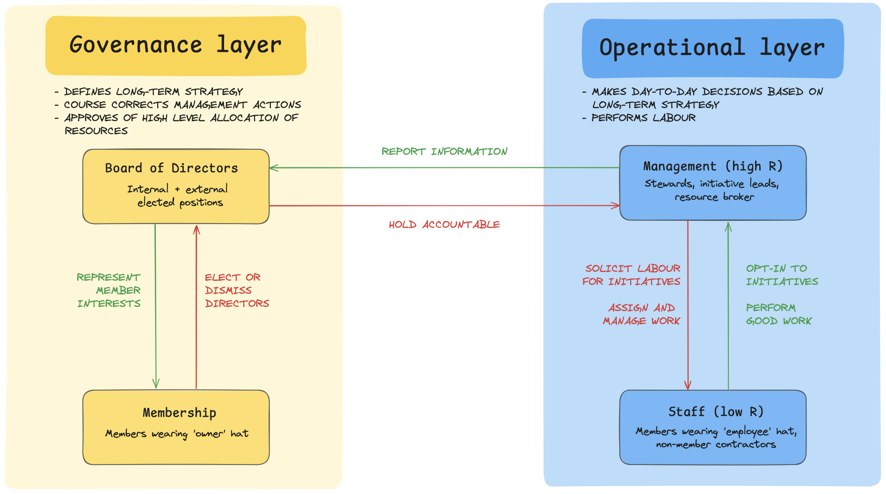

# Governance Structure

This page outlines the relationship between the Board of Directors, Practice Leads, Staff, and Membership, in the context of governance.

## Roles in the Co-operative

### Board of Directors

The Board of Directors is a group of people that includes full members of the Co-operative and non-members who otherwise have no association with the Co-operative (87(3) in Co-operative Corporations Act). The non-members portion of the board is optional and is limited to 20% of the board.

The recommended size of the board is four directors who are members of the co-op and optionally one external director.

Directors are elected and dismissed by the Co-operative members. The board is entrusted to make decisions in the best interests of the members. They will do so through advising and holding practice leads accountable. 

Officer positions (e.g. President) within the board are elected by the directors.

#### Director Responsibilities

* Must meet once a quarter
* Represent the interests of membership
* Prioritize and evaluate decisions to be taken by high responsibility members 
* Allocate resources based on data provided by high responsibility members, e.g. approval of budgets and working group mandates and strategies
* Make recommendations on the scope of work for each working group
* Review labour practices to identify any shortcomings in our competitiveness as an employer
* Facilitate access and deals between the Co-operative and external parties

#### Officers 

A subset of the board are elected as officers. Officers are elected by and subject to direction from the board.
* President
  * Chair meetings of directors or designate a member of the board to chair
  * Cast the deciding vote in the event of a tie
* Vice-President
  * Assume the President’s duties and powers whenever the President is not available
* Secretary
  * Call member/board meetings
  * Steward legal documents
* Treasurer
  * Hold custody of the Co-operative's funds
  * Steward the books of account

### Members
Members ultimately hold the highest level of governance power in the organization. Members, including individuals in their probationary period, may make policy proposals for the betterment of the Co-op. Members get a vote. If it touches membership changes or bylaws, then the board needs to sign off on those proposals. Existing members are responsible for accepting new members to the Co-operative, through voting and recommendation to the board, as defined in the bylaws. 

Technically all roles represented in this governance diagram are held by members, sometimes at the same time. Members need to think carefully about the differences between the mindset of a member acting in a governance capacity, a managment capacity, and a staff capacity.

### Staff
Individuals who do work at Hypha with a lower level of decision-making responsibility. There are two kinds of staff:
* Employees
  * Perform the work as established by their team and high-responsibility members
* Contractors
  * Perform the work as established by their team and high-responsibility membe

### Management
Individuals appointed by the board of directors who make higher-responsibility decisions for the work that happens within the co-operative.
* Propose budgets
* Make staffing decisions
* Assign work to staff in alignment with the co-op's mission

## Summary

* The board:
  * Approves and dismisses high-responsibility members
  * Elects and removes board officers.
  * Demonstrates that it represents membership interests to the members.
* Members:
  * Elect and dismiss directors.
  * Recommend membership changes to the board.
* Staff:
  * Performs the work as established by management-level members.
* Management:
  * Hire or dismiss staff, assign and manage work.
  * Report and are accountable to the board
* The board of directors and members comprise a governance group, which:
  * Defines the long-term strategy.
  * Course-corrects management actions.
  * Approves resource allocation.
* The management and staff comprise an operational group, which translates long-term strategy to short-term.

