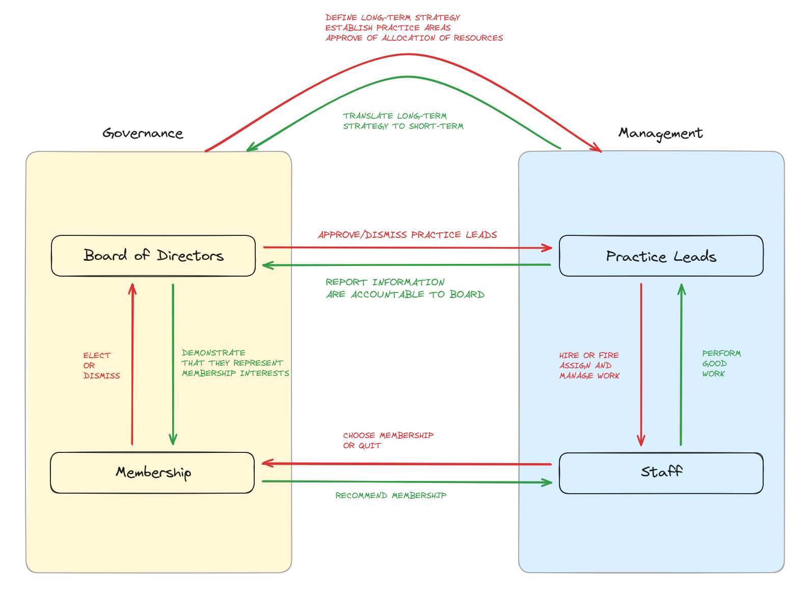

# Governance Structure

This page outlines the relationship between the Board of Directors, Practice Leads, Staff, and Membership, in the context of governance.

## Roles in the Co-operative

### Board of Directors

The Board of Directors is a group of people that includes full members of the Co-operative and non-members who otherwise have no association with the Co-operative (87(3) in Co-operative Corporations Act). The non-members portion of the board is optional and is limited to 20% of the board.

The recommended size of the board is four directors who are members of the co-op and optionally one external director.

Directors are elected and dismissed by the Co-operative members.

#### Director Responsibilities

* Must meet once a quarter
* Represent the interests of membership
* Establish the mission for each practice area and make recommendations for its growth and development
* Prioritize and evaluate decisions to be taken by practice area leads
* Allocate resources based on data provided by practice leads, e.g. approval of practice area budgets and working group mandates and strategies
* Make recommendations on the scope of work for each working group
* Review labour practices to identify any shortcomings in our competitiveness as an employer
* Facilitate access and deals between the Co-operative and external parties

#### Officers 

A subset of the board are elected as officers. Officers are elected by and subject to direction from the board.
* President
  * Chair meetings of directors or designate a member of the board to chair
  * Cast the deciding vote in the event of a tie
* Vice-President
  * Assume the President’s duties and powers whenever the President is not available
* Secretary
  * Call member/board meetings
  * Steward legal documents
* Treasurer
  * Hold custody of the Co-operative's funds
  * Steward the books of account

### Members
Members ultimately hold the highest level of governance power in the organization. Members, including probationary members, may make policy proposals for the betterment of the Co-op. Full members get a vote. If it touches membership changes or bylaws, then the board needs to sign off on those proposals.

There are two levels of membership:
* Full members
  * Elect or dismiss members of the board of directors
* Probationary members
  * Must complete their probationary period before they get to vote

### Staff

Individuals who do work at Hypha. There are two kinds of staff:
* Employees
  * Perform the work as established by their practice area
* Contractors
  * Perform the work as established by their practice area

### Practice leads
Individuals appointed by the board of directors.
* Propose practice area budgets
* Assign work to the practice area staff in alignment with the practice area mission

## Governance Powers

The board is elected, and entrusted by all full members to make decisions in the best interests of the co-op members. They will do so through advising and holding practice leads accountable. 

Members are to elect all directors on the board. Officer positions (e.g. President) within the board remain elected by the directors. Full members are responsible for accepting new members to the membership, through voting and recommendation to the board, as defined in the bylaws. 

In summary:
* Board accepts / dismisses members
* Board appoints / removes practice leads
* Practice lead hires / dismisses staff
* Members recommend membership changes to the board
* Members elect / remove directors
* Directors elect / remove officers
* Staff applies to membership and may choose to withdraw from membership or the co-op as a whole

## Governance-Management Roles and Relationships

