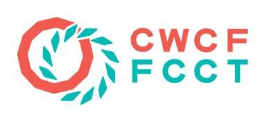

# Hypha Worker Co-operative

## About Us

Hypha is a worker co-operative based in Toronto which helps organizations and communities redesign their relationships with digital technology. Our team of technologists, designers, and community organizers provide digital strategy and coaching, research, web and mobile design and development, and infrastructure deployment services.

## The Co-operative

Hypha Worker Co-operative Inc. is a worker co-operative incorporated on August 
1, 2019 in Ontario, Canada (Ontario Corporation No. 5019866).

Hypha is incorporated as a **non-share capital** worker co-operative under the 
[*Ontario Co-operative Corporations Act, 1990*][coop-act]. 
This entails specific conditions on our primary object, size of membership, 
and role of members, as addressed in Article [1], [144.1], and [145] of the Act.

We are a non-profit _organization_. 
That means our organization does not operate with the primary purpose of generating profit. 
As per 2017's [_Cutting Unnecessary Red Tape Act_](https://www.ontario.ca/laws/statute/s17020), 
Hypha falls under neither the current [_Corporations Act_](https://www.ontario.ca/laws/statute/90c38), 
nor the upcoming [_Not-for-Profit Corporations Act_](https://www.ontario.ca/laws/statute/10n15), 
which both govern not-for-profit _corporations_ in Ontario.
Instead, we are a [not-for-profit _co-operative_][not-for-profit-coop].

Hypha is a member of [Canadian Worker Co-op Federation (CWCF)](https://canadianworker.coop/), 
and through that affiliation is a member of the [Ontario Co-operative Association (OCA)](https://ontario.coop/) and [Cooperatives and Mutuals Canada (CMC)](https://canada.coop/).[1](#notes) 

You can contact us the following ways:

- 📞 +1-437-887-6936
- 📫 #1308-1403 Royal York Road, Etobicoke, Ontario  M9P 0A1
- 🔗 [hypha.coop](https://hypha.coop)
- 📧 hello@hypha.coop

## Members and Employees

Every **member-worker**, or **member** in short, is both a member and an employee of Hypha.
There are seven members, all of which are founding members, with six also serving as directors.

A **member**:
  - Has completed a membership application (and/or been officially welcomed into 
    the membership)
  - Is a *founding*, or *permanent*, member if they are one of the seven members who founded Hypha
  - Is considered:
    - *active* if they have not requested to change their status
    - *inactive* if they have requested to change their status
      - Inactive members are unable to vote, serve as a director, participate in 
        projects, or work as an employee for so long as they remain so
      - Inactive members can request to become active at any time

An **employee**: 
  - Works as an *employee* under a *contract of service* with Hypha, see the [CWCF's "Guidelines for Determining Whether or Not There Is an Employer-Employee Relationship in a worker Co-op"][cwcf-guidelines] for clarification
  - Is "someone who performs work for an employer for wages," meeting the 
    [*Employment Standards Act, 2000*][es-act] [definition of employee][esa-employee] 
  - Is considered *permanent* if they:
    - Have completed a probationary period of one year 
    - Are not working under contract

A **contractor**:
  - Works as an *independent* contractor under a *contract for service* with Hypha
  - Provides services clearly specified in a time-limited contractor agreement
  - May be a natural person or incorporated entity, domestic or foreign

A **collaborator**:
  - Participates in open Hypha activities and projects without a formal employment
    relationship

As every member holds a dual position as both a member and an employee of Hypha,
they must make a distinction between *member duties* and *employee work*.
Our bylaws do not allow for members to be contractors and we currently do not employ *dependent contractors*.
Members are expected to acknowledge these components of their relationship with Hypha by signing the *Membership Acknowledgement*.

Employees, as well as contractors and collaborators engaged in certain initiatives with Hypha,
are expected to sign an *Employee and Contractor Intellectual Property Agreement* and comply with
[tax obligations as applicable to them](https://handbook.hypha.coop/finance.html#gsthst-rt).

As a worker co-operative, there are specific conditions regarding members and employees, 
addressed in Article [1], [144.1] and [145] of the [*Ontario Co-operative Corporations Act*][coop-act]. 
A summary is provided below:

> Article 1 (1)
> "Worker co-operative" means a co-operative whose primary object is to provide employment to its members and as a condition of membership that, except in certain circumstances, a member must be employed by the co-operative (roughly at least 75 % of all employees are members of the co-operative, there are specific exemptions).
>
> Article 1 (1.2) (and repeated in 144.1 (2))
> An employee is not a permanent full-time employee if they are employed for a probationary period of one year or less; are employed under a contract for a term of two years or less; or have regular hours of work [that are] less than fifteen hours per week.
>
> Article 145 (4)  
> The co-operative must maintain a minimum of three members.

## Notes

1. A full list of [CWCF affiliations](https://canadianworker.coop/about/affliations/) is on their website.

<!-- Links -->
[coop-act]: https://www.ontario.ca/laws/statute/90c35
[es-act]: https://www.ontario.ca/laws/statute/00e41
[esa-employee]: https://www.ontario.ca/document/changing-workplaces-review-final-report/chapter-8-who-employer-and-who-employee-under-employment-standards-act-2000#section-1
[not-for-profit-coop]: https://ontario.coop/sites/default/files/STR06_For%20Profit%20and%20Not%20for%20Profit%20Co-ops.pdf
[cwcf-guidelines]: https://canadianworker.coop/guidelines-for-determining-whether-or-not-there-is-an-employer-employee-relationship-in-a-worker-co-op/
