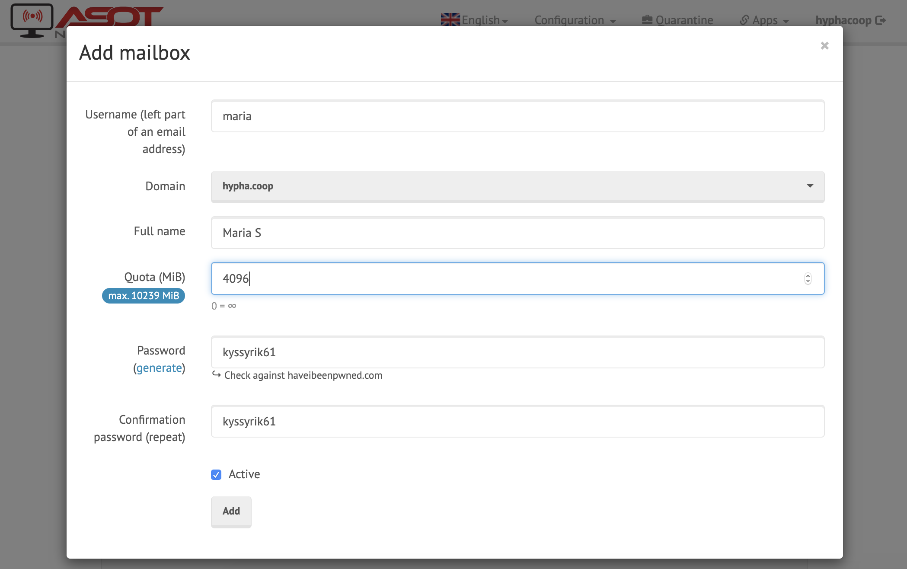
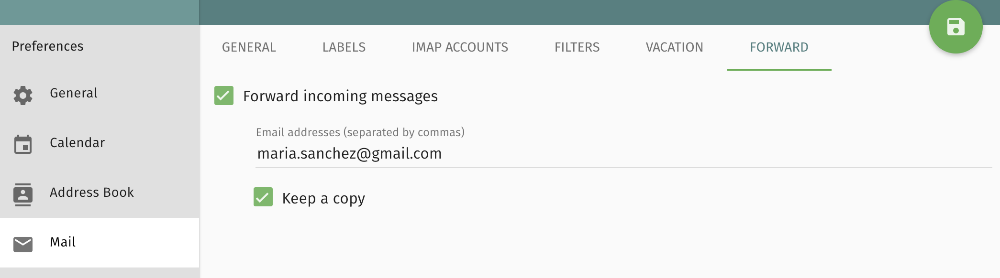

# Guides

Guides explain in practical terms how we do stuff. Any Hypha member can
change these.<sup>[1](#references)</sup>

We are inspired by the idea of "protocols" from the [Lab
Book][clear-lab-book] of the [Civic Laboratory for Environmental Action
Research (CLEAR)][clear]

> Protocols are the "attitudes" or "the manner in which one approaches each and
every element in our space." They are different than pure rules or
instructions; they are ways that we establish order and maintain practices
across our group [...] -- They define the way we ought to proceed or behave in
different situations. As such, they are normative, or premised on values,
morals, and an idea of how things ought to be done. They are a manifestation of
our values.

### Contents

- [Calendar](#calendar)
- [Email](#email)
- [Expense Reimbursement](#expense-reimbursement)
- [Hiring](#hiring)
- [Invoices](#invoices)
- [Issue Labels](#issue-labels)
- [Inactivating Membership](#inactivating-membership)
- [Meetings](#meetings)
- [Payroll](#payroll)
- [Initatives](#initatives)
- [Sensitive Data](#sensitive-data)
- [Signatures](#signatures)
- [Shortlinks](#shortlinks)
- [Timesheets](#timesheets)
- [Voicemail](#voicemail)
- [References](#references)

## Calendar

### Syncing your SOGo calendar

You can use CalDAV to two-way sync your SOGo calendar with calendar applications on mobile and desktop devices:

For Gmail app on **Android**, install [CalDAV Sync Adapter](https://f-droid.org/en/packages/org.gege.caldavsyncadapter/) from F-Droid, then navigate to `Settings > Accounts` and configure the Sync Adapter with server `https://mailninja.aseriesoftubez.com/SOGo/dav/` and your SOGo credentials.

For **iOS**, navigate to `Settings > Mail, Contacts, Calendars > Add Account > Other`, under `Calendars` select `Add CalDAV Account` and configure with server `https://mailninja.aseriesoftubez.com/SOGo/dav/` and your SOGo credentials.

For other applications and platforms that support CalDAV, configure with server `https://mailninja.aseriesoftubez.com/SOGo/dav/` and your SOGo credentials.

### Creating a shared calendar

1. Login to your [SOGo account](https://mailninja.aseriesoftubez.com/SOGo/)

1. Navigate to the Calendar interface and create a new calendar

1. Configure shared access by selecting `Sharing...` in the new calendar

1. If there are external collaborators who need `Modify` access, request a SOGo account for them on the `hypha.local` domain and configure as follow

  

1. Optionally, sync with calendar applications using the CalDAV and WebDAV URLs for `Authenticated User Access` and `Public Access`

## Email

### Creating new inboxes (Administrators)

What you'll need:
- Admin access to [our Mailcow email server](https://link.hypha.coop/email)
- The following user info (from https://link.hypha.coop/employees):
    - preferred email handle e.g., `handle@hypha.coop` (under "@hypha.coop" column)
    - preferred public name (under "Public Name")
    - email they'd like `@hypha.coop` forwarded to (under "Primary Email")
    - Signal-friendly phone number (under "Signal Phone" or "Phone")

_Note: Consider creating a [new GitHub issue in `hyphacoop/organizing`](https://github.com/hyphacoop/organizing/issues/new) to track email onboarding._

1. Sign into Mailcow: https://link.hypha.coop/email
    <details>
      <summary>View Screenshot 🔎</summary>
      
    </details>
2. Navigate to "Mailboxes" tab
3. Click "+Add mailbox" button at top-right of screen
    - If the namespace is already taken by an alias, ensure it's not in use before deleting it.
    <details>
      <summary>View Screenshot 🔎</summary>
      
    </details>
4. Fill out the following fields, noting the password:
    - Username: `[use preferred email handle]`
    - Domain: `hypha.coop`
    - Full name: `[use preferred public name]`
    - Quota: `4096`
    - Password: `[auto-generated]`
    - Active: `checked` ☑
    <details>
      <summary>View Screenshot 🔎</summary>
      
    </details>

We'll now log in to confirm access, and set up an initial forwarder to make first-time usage simpler.

5. Open an incognito browser and access webmail login: https://mailninja.aseriesoftubez.com/SOGo/
6. Log into the account you just created.
    <details>
      <summary>View Screenshot 🔎</summary>
      
    </details>
7. Navigate through these menus:  
    `⚙` (top-left) > `Mail` menu item > `Forward` tab
8. Check "Forward incoming mail" and enter provided primary email, clicking "Keep a copy".
    <details>
      <summary>View Screenshot 🔎</summary>
      
    </details>
9. From your own `@hypha.coop` email, send a welcome email, like this template:
    > Hi XXXX --
    >
    > Yay! Your Hypha email's set up and forwarding to your personal inbox. People can start emailing you at this address immediately, without any extra effort on your part.
    >
    > Your new email (and login): XXX@hypha.coop  
    > Your password: Sent via Signal to XXX-XXX-XXXX
    >
    > Having said that, when you'd like to start _sending_ email as XXX@hypha.coop, you'll need to take some more steps.
    >
    > The next steps will depend on how you like to handle email:
    > - [If you'd like to use it from your existing Gmail account...](#using-gmail)
    > - [If you'd like to use it from our hosted webmail interface...](#using-the-webmail-interface)
    > - [If you'd like to use it from another email client...](#using-your-existing-email-client)
    >
    > Once you're set up, let us know by sending a test email to infra@hypha.coop, ideally with a short emoji-only story. (Keypad mashes a-ok!) We'll send a friendly poke in a week if we haven't heard back.
    >
    > Questions? Feedback? Reach out via infra@hypha.coop or [`#hyphacoop-infra:tomesh.net`](https://chat.tomesh.net/#/room/#hyphacoop-infra:tomesh.net) for chat.
    >
    > In Solidarity,  
    > xxxxx
10. Send a Signal message with the previously noted password, for example: `🍄 hypha email password: xxxxxxxx`

### Using your new inbox (Users)

Accessing your inbox can be done via the hosted webmail interface or by using the same email client you're already using.

What you'll need:
- Your new email address
- Your password (sent to you by admin on initial setup)

#### Using Gmail

1. Log into Gmail
2. Go to Gmail settings, by navigating through these menus:  
    `⚙` (top-left) > `Settings` menu item > `Accounts and Import` tab
3. Under "Send mail as", click "Add another email address".
    <details>
      <summary>View Screenshot 🔎</summary>
      
    </details>
5. In the new popup, enter:
    - Name: e.g., `Maria S` (as will appear to email recipients)
    - Email address: e.g., `maria@hypha.coop`
    - Treat as alias: `checked` ☑
    <details>
      <summary>View Screenshot 🔎</summary>
      
    </details>
4. Click "Next", then:
    - SMTP Server: `mailninja.aseriesoftubez.com` (auto-filled)
    - Port: `587` (auto-filled)
    - Username: e.g., `maria@hypha.coop` (ignore auto-filled)
    - Password: `[your password]`
    - TLS: `checked` ☑
    <details>
      <summary>View Screenshot 🔎</summary>
      
    </details>
5. Click "Add Account".

We'll now send your first email to Mailinator, a cloud inbox that's helpful for email testing. Then you can confirm for yourself whether it works.

5. Back in your Gmail inbox, click "Compose" to create a new email message.
6. Click the "From" address, and select your new email address from the drop-down.
    <details>
      <summary>View Screenshot 🔎</summary>
      
    </details>
8. Enter hyphacoop@mailinator.com as the "To" address, add a short subject and message, and hit send!
9. Visit [the corresponding cloud inbox](https://www.mailinator.com/v3/index.jsp?zone=public&query=hyphacoop) and confirm your message has arrived, it might take a few minutes.
    <details>
      <summary>View Screenshot 🔎</summary>
      
    </details>
11. Once it's safely arrived, you're all set! Start sending email!
12. Don't forget to **email Infra WG** as mentioned in onboarding email. 📤🎉

#### Using the webmail interface

1. Visit our email server: https://link.hypha.coop/email
2. Click on `Webmail` button.
3. Enter your username and password:
    - Username is your `@hypha.coop` email
4. Once logged in you can read your emails and configure your user settings.
5. By default your emails are forwarded to your personal email to disable that follow step 1 in `Using your existing email client`.

#### Using your existing email client

<sup>These docs are condensed from [Mailcow's in-depth email client configuration docs](https://mailcow.github.io/mailcow-dockerized-docs/client/#host=MailNinja.aseriesoftubez.com&email=maria%40hypha.coop&name=Maria+Sanchez&ui=mailninja.aseriesoftubez.com&port=443&outlookEAS=1&connector=60.0.2). (Substitute your info for that of "Maria Sanchez").</sup>

1. By default emails to your `@hypha.coop` are forwarded to your personal email address if prefered that you want to turn off forwarding of your `@hypha.coop` email, log in to webmail (instructions above)
    - Navigate through these menus:  
        `⚙` (top-left) > `Mail` menu item > `Forward` tab
2. Uncheck the "Forward incoming messages", and save.
3. Open your email client.
4. Go to the "add email account" setting in your client.
5. Enter your name that you prefer that will show up in your outgoing emails and email address when prompted.
6. When prompted for username and password use your new email address e.g., `handle@hypha.coop` for username and your password for your new email.
7. Most email clients will auto-detect server settings based on your email address. If your email client does not auto-detect these settings, enter:
    - IMAP: `mailninja.aseriesoftubez.com` Port: 993 (TLS/SSL)
    - SMTP: `mailninja.aseriesoftubez.com` Port: 465 (TLS/SSL)
8. Once added, you should now be able to send from your new email. In your email client, compose an email to hyphacoop@mailinator.com with a short subject and send.
9. Visit [the corresponding cloud inbox](https://www.mailinator.com/v3/index.jsp?zone=public&query=hyphacoop) and confirm your message has arrived, It might take a few minutes.
10. Don’t forget to email Infra WG as mentioned in onboarding email.

## Expense Reimbursement

Employees should submit eligible expenses in the same quarter they are incurred.
The Finance WG reviews submitted expenses before each pay period, and pays out reimbursement amounts on the next pay day.

### Submitting an expense

1. Upload the expense receipt to [Employee Expense Receipts](https://link.hypha.coop/receipts) with file name `xx-YYYY-MM-DD-title.ext` where `xx` is the initials of the member, `title` describes the expense, and `ext` is the file extension, then make note of the URL.

1. Open the [Employee Expenses](https://link.hypha.coop/expenses) sheet and fill in a new row according to instructions in the sheet.
    - Date of Expense: `[date on your receipt]`
    - Employee: `[employee to reimburse]`
    - Description of Expense: `[short description of what the expense is for]`
    - Total Amount: `[total receipt amount, including HST]`
    - HST Amount: `[total HST on the receipt]` 
    - Currency: `[currency of the receipt]` (default to `CAD`)
    - Exchange Rate: `[currency exchange rate to CAD]` (default to `1.000` for CAD, you can use the rate on your credit card statement or [Bank of Canada rate](https://www.bankofcanada.ca/rates/exchange/) on the receipt date)
    - Receipt Link: `[link to uploaded receipt]`

1. That's it.
    Once finance approves the expense it will show up beside your name on the [Employee Payroll](http://link.hypha.coop/payroll) sheet and you will be reimbursed in that pay period.
    The amount will _not_ appear on your tax forms.

### Approving an expense for reimbursement

For the Finance WG to approve an expense:

1. Verify all expenses that do not have a `Pay Period of Reimbursement` selected.

1. Select a `Cost Center / Project` and `Pay Period of Reimbursement`.

1. Verify that the `Total Amount (CAD)` is added to the [Reimbursement Summary](http://link.hypha.coop/reimbursement) sheet to the correct `Pay Period of Reimbursement` and `Employee`.

1. Verify that the amount shows up correctly on the `Expense Reimbursement` column on [Employee Payroll](http://link.hypha.coop/payroll) of the applicable pay period, so it gets entered into Wagepoint on the next payroll run.

1. After reimbursements are paid out through Wagepoint, our bookkeeper will file the the amounts into expense accounts in [Quickbooks Online](https://quickbooks.intuit.com/ca/) based on the [Posting Journals](https://drive.google.com/drive/u/0/folders/1wWo9KqNwWdUK5d-jkApV3id_Y_dpftT9) and [Employee Expenses](https://link.hypha.coop/expenses) sheet.

## Hiring 


### Onboarding a member 

When a new member or employee is about to start their position at Hypha,  Operations will work set them up in the virtual office following the [Onboarding](./onboarding.md) materials and [checklist](./templates/checklist-onboarding.md).


## Inactivating Membership

When members seek to go inactive they should do the following:

1. Send an email to [operations@hypha.coop](mailto:operations@hypha.coop) with notification of the change and the date you wish to become inactive and return (if known).

Operations then will work with Infrastructure to update appropriate permissions and access inline with our Working Open guidelines and [offboarding checklist](./templates/checklist-offboarding.md).

## Invoices

Prior to creating an invoice, confirm with the client whether they would like to pay in CAD, USD, EUR, or GBP, and in what country their financial institution is based, then proceed with the following steps.

### Creating an invoice for a client

1. Go to [Quickbooks Online](https://quickbooks.intuit.com/ca/), open the `Invoicing > Customers` tab.

1. If the client is not in the customer list, click `New customer` to create a new profile for the client.

1. Click `Create invoice` on the client you wish to invoice, and use the following settings:
    - Cc.: `finance@hypha.coop`
    - Terms: `Net 15` (may vary by project)
    - Message on invoice: `[Payment instructions]` (e.g. Please pay USD 3,135.00)
    - Attachments: `[Timesheet PDFs]`

1. At the bottom of the page, click `Customize` to select a style, or create a new style template as needed.

1. If creating a new style template or the payment information needs to be changed, select the `Content` tab, click on the bottom section of the template preview to reveal the `Add payment details and footer` section, then enter the [applicable payment information](https://github.com/hyphacoop/organizing-private/blob/master/documents/finances/payments.md).

    For example:
    ```
    PAYMENT

    By ACH or domestic wire transfer to:

    ACH Transfer No. (ABA): 026073150
    Wire Transfer No. (ABA): 026073008
    Account No.: [REDACTED]
    Beneficiary Name: Hypha Worker Co-operative Inc.
    Beneficiary Address:

        TransferWise
        19 W 24th Street
        New York
        10010
        United States

    Invoice amount will be adjusted to reflect actual exchange rate after payment.
    ```

    This is an invoice for a client based in the United States, payable in USD to our TransferWise account.
    Look at a previous invoice for examples.

    Review the invoice preview, then click `Done`.

1. Fill in the line items and calculate totals.
    See example below.

    All invoices are in CAD, even if the customer is paying in a foreign currency. This means `RATE` and `AMOUNT` columns are in CAD, and if the contract is an hourly rate based on a foreign currency, you can include the information in the `DESCRIPTION` column, and use an estimated CAD equivalent in the `RATE` column and to calculate the `AMOUNT`.

1. In the `SALES TAX` column, select one of `HST ON`, `zero-rated`, `exempt`, or `out of scope` for each line item.
    See example below.

1. Review the invoice preview, then click `Save and send` to email the invoice to the client.

| DESCRIPTION | QTY | RATE | AMOUNT | SALES TAX |
|:------------|----:|-----:|-------:|----------:|
| Software development for Jan 2020<br />(52.25 @ USD 60.00 = 3,135.00) | 52.25    | 80.00 | 4,180.00           | zero-rated |
| Software development for Feb 2020<br />(20.00 @ USD 60.00 = 1,200.00) | 20.00    | 80.00 | 1,600.00           | zero-rated |

### Settling an invoice payment

Once the client has paid the invoice, we must check the amount received at our receiving account at [Desjardins](https://www.desjardins.com/ca/) (domestic) or [TransferWise](https://wise.com) (foreign currency), and record the transaction in [Quickbooks Online](https://quickbooks.intuit.com/ca/).

#### Domestic

1. After the money arrives to Desjardins, we need to update our records in Quickbooks Online:

    1. In the `Banking` tab, select our `Chequing` account and click `Update` to sync our Desjardins account.

    1. Find the transaction from the client and click on it, then select `Find match` to select the incoming transaction to match.

    1. If there is a discrepancy in the amounts, click the `Resolve` button and change `CATEGORY` to `Bank charges`, and `GST/HST` to `Exempt (0%)` since bank charges are exempt items, then click `Save`.

1. Archive the PDF of the paid and finalized invoice in our [shared drive](https://link.hypha.coop/drive) under the `Invoices` directory with filename `xxxx-project.pdf`, where `xxxx` is the invoice number (e.g. `1001-aether.pdf`).

#### Foreign Currency

1. Confirm the correct amount is received, then convert the foreign currency to CAD.
We can either move the money to the CAD balance in TransferWise, or if the amount is large, we can directly deposit the exchanged amount into our Desjardins account.
The following example shows how to do that in a single transaction from TransferWise:

    1. Confirm that the invoice amount of `3,757.50 USD` is received to our USD balance, then click `Send USD`.

    

    

    1. Choose `My business` and enter in our [Desjardins account information](https://github.com/hyphacoop/organizing-private/blob/master/documents/finances/payments.md) for the deposit.

    

    

    1. Note the invoice number in the `Reference` field, then click `Confirm and send`.

    

    In this example, a client in the United States sent **3,757.50 USD** to the Hypha USD account at TransferWise, and we deposited **4,904.11 CAD** at the Hypha CAD account at Desjardins.
    The transaction and exchange fee was **20.61 USD**, and the exchange rate was **1.31235**.

    If invoice amounts are small, we may batch many of them in TransferWise before depositing to Desjardins, but we should still convert foreign currencies to CAD as soon as possible and hold the amount as CAD in our TransferWise CAD balance.

    1. In the USD balance, click on `Download a statement` and download a CSV file for the date range that includes the transaction(s).
    Open the file and multiply the amounts with the exchange rate column, then save.

1. After the money arrives to Desjardins, we need to update our records in Quickbooks Online:

    1. Click on the invoice and add a line item that accommodates for the discrepancy in estimated and actual exchange rates.

        In our example where we deposited **4,904.11 CAD** to Desjardins, if our invoice estimated a CAD `AMOUNT` of **4,950.00 CAD**, we would record an `Exchange rate adjustment @ 1.31235` line item with `-45.89` as `AMOUNT`.
        Make sure you take the exchange rate from the TransferWise CSV.

    1. In the `Banking` tab, select our `Chequing` account and click `Update` to sync our Desjardins account.
        Find the transaction from TransferWise and click on it, and change the `Category` to `TransferWise`, change `Tax code` to `Out of Scope (Sales)` since this is an internal transfer, then click `Add`.

    1. In the `Banking` tab, select our `TransferWise` account to click `File upload` (down arrow next to `Update`) to update our TransferWise account.
        `Browse` and upload the TransferWise CSV we saved earlier, select `TransferWise` as the account, then click `Next` and enter the following:
        - Date: `Column 2`
        - Description: `Column 5`
        - Amount: `Column 3`

    Click `Next` twice, and then `Yes` to import.

    1. Find the transaction from the client and click on it, then select `Find match` to select the incoming transaction to match.
        There should be no discrepancy in the amounts.

    1. Find the transaction from our TransferWise account to Desjardins account, then select `Find match`.
        We expect a discrepancy in the amounts.
        Click the `Resolve` button and change `CATEGORY` to `Bank charges`, then click `Save`.

    1. If there is a discrepancy, click the `Resolve` button and change `CATEGORY` to `Bank charges`, and `GST/HST` to `Exempt (0%)` since bank charges are exempt items, then click `Save`.

1. Archive the PDF of the paid and finalized invoice in our [shared drive](https://link.hypha.coop/drive) under the `Invoices` directory with filename `xxxx-project.pdf`, where `xxxx` is the invoice number (e.g. `1001-aether.pdf`).

## Issue Labels

We have specific GitHub repos (known as _synced repos_ throughout this guide) configured to mirror all labels from the root `hyphacoop/organizing`,
on each change to the root repo's labels.
Though some of the below steps are more complicated than we'd ideally like,
this is because the automation is cautious and won't delete _any_ in-use labels (regardless of open/closed state),
so _nothing destructive will happen_.

To **manage the list of _synced repos_** (e.g., ensuring a new repo starts having labels synced),
add a new entry to `LABEL_REPO_TARGETS` in [this configuration file](https://github.com/hyphacoop/organizing/blob/master/.github/workflows/sync-labels.yml#L24) and ensure [@hyphacoop-bot has write-access](https://github.com/orgs/hyphacoop/people/hyphacoop-bot) to each synced repo.

To **create a new label**, just add it to the `hyphacoop/organizing` repo,
and it will be added to others within a few minutes.
(Sync events are [logged in this issue as new comments](https://github.com/hyphacoop/organizing/issues/145) for troubleshooting.)

To **delete an existing label**, search for the label you'd like to delete,
[like so](https://github.com/issues?q=org:hyphacoop+label:doomed-label).
Our automation is cautious, and so will only delete labels from repos where it's _NOT in use_.
For any repos represented in the search results, delete the label from that repo.
Once no labelled issues show up, delete the label from `hyphacoop/organizing`,
and anything else will be cleaned up. If you leave any issues labelled,
the automation will simply do cleanup on its next run.
As soon as a label is unused in a repo, the automation will remove it on the next run.

To **rename an existing label** (this one's a bit tricky),
search for the label you'd like to rename,
[like so](https://github.com/issues?q=org:hyphacoop+label:wg:finance).
Ignore `hyphacoop/organizing` for now, we'll save it for last.
For every other repo where it's used, click the "repo" link,
and visit the label page to manually rename.
Lastly, rename the label in `hyphacoop/organizing`,
and it will ensure the label is removed in any repos where it wasn't in-use.
(Renaming is understood by the automation as a newly created label and a deleted label.)

To **force a label sync**, assuming you're impatient for it to do clean-up of unsued labels,
slightly change a _description_ or _color_ of a label in `hyphacoop/organizing`.

## Meetings

### Scheduling a meeting

_Note: Consider whether this meeting might be a global interest to other
members. Skip the steps below at your discretion for low-stakes topics._

- Try to announce your intention to schedule a meeting on a topic and ask
  who's interested in participating. Allow _at least_ 48 hours for people to respond.
- Consider who might be most interested and what timing might work for
  them.
  - Check the [`availability` calendar for travel/vacation plans][availability].
  - Check everyone's [availability `schedules`][schedules].
- If 2-3 candidate timeslots feel obvious from looking at people's
  availabilities:
  - Reserve them all in [Hypha calendar][calendar] immediately, for example: `HOLD:
    Infrastructure Meeting (Option 1)`
  - Ask in chat whether anyone who wants to attend has any blocks on any
    of the options
- If short-notice or speed of booking is important:
  - Claim an open HOLD [:information_source:](/meetings.md#calendar-holds) slot.
    - If time permits or topic isn't an all-hands matter, consider
      leaving the hold available for someone else
    - If claiming a hold, edit the calendar immediately and announce
      meeting in chat
- If your must find a new timeslot:
  - Create a new poll (we currently use [When2Meet](https://www.when2meet.com/))
  - Leave ample time for completion (ideally 1 week)
  - Check on non-responders in following days and send (gentle)
    reminders as needed

### Hosting a meeting

- **Before** the meeting...
  - create a stub agenda as soon as possible (can be done before scheduling)
    - Hint: use [an agenda `template`][template]
  - add the agenda to the [`meetings` index][meetings]
  - update the [organizational calendar][calendar] as early as possible with candidate and finalized time slots
    progresses
  - mention the meeting time in chat, and link the agenda.
  - encourage migration of related actions, decisions and discussions
    into agenda from chat
- **During** the meeting...
  - ask for agenda items (start of meeting)
  - facilitate discussion
  - keep time
  - call attention to action items, upcoming decisions and discussions
- **After** the meeting...
  - add important dates/reminders to calendar
  - review and merge notes
  - update [meeting index][meetings] as best location changes
    (hackmd => review (PR) => file)
  - as needed, set up loomio threads and decisions
  - as needed, send reminders of action items
  - migrate action items into task tracker
  
### Joining a BigBlueButton Call

💻 **Desktop and 📱Mobile.** Follow [`link.hypha.coop/calls`](https://link.hypha.coop/calls) to our default conference platform.

🎤 **Mic Selection** - Some browsers (such as FireFox) you will ask you for your microphone selection at the same time the browser asks you for permission to use the microphone. Other browsers (such as Chrome) will not.  In those cases you will have to proceed to the `Echo Test` and answer `No` to `Do you hear audio?`. This will bring up a dialog to change your mic input.
📞 **Phone**
  1. Ask a member already in the conference room for the pin number which is shown in the `Public Chat` area.
  2. Use the private dial-in number from our [technical BigBlueButton documentation](https://github.com/hyphacoop/organizing-private/blob/master/documents/infrastructure/bigbluebutton.md#connection-details).
  3. _After_ prompt, enter the pin number for the meeting
  4. Use the below number keys to change your settings
   - Press 0 to toggle mute and unmute
   - Increase your mic volume
      - 3 Talk Volume Up
      - 2 Talk Volume Zero (default)
      - 1 Talk Volume Down

   - Increase everyone else’s volume
      - 6 Listen Volume Up
      - 5 Listen Volume Zero (default)
      - 4 Listen Volume Down

   - Energy level is a threshold that dictates the level at which a person is determined to be speaking versus the background noise received.
      - 9 Energy Up
      - 8 Energy Zero (default)
      - 7 Energy Down

## Payroll

This guide describes how to use our payroll service provider, [Wagepoint](https://wagepoint.com), to set up a payroll run for the pay period.
You should have a completed [Employee Payroll](http://link.hypha.coop/payroll) sheet for the pay period ready, which indicates the wage information for each Employee that you will need to enter into Wagepoint.

If this is the first time you use Wagepoint, please first review the [Running your first payroll with Wagepoint - Canada](https://www.youtube.com/watch?v=KfLMcqGTDwE)video.

### Running payroll

1. Log into Wagepoint as a user with admin privileges.

1. Visit the `PAYROLL` tab.

1. **Paygroup:** Hit `NEXT` since we only have one monthly paygroup.

    

1. **Paydates:** Set the pay cycle to cover the current month (e.g., March 1-31) and the `Pay Date` to be the 15th of the current month (e.g., March 15) or the last working day prior if the 15th happens to land on a holiday (e.g., March 13).
    During that period, we settle amounts owed up to the _end of the previous month_ (e.g., Feb 29).

    
    
    Set the dates as per the above, and hit `NEXT`.
    Nothing is finalized until the last step, and you must hit `SAVE/NEXT` during each step to preserve "draft" progress.

1. **Hours:** Hit `SAVE/NEXT` to skip since we currently do not use the `Hourly` pay type.

1. **Salary:** Enter `HOURS`, `CURRENT PAY`, `EXPENSE REIMBURSEMENT`, and `PUBLIC HOLIDAY PAY` according to the [Employee Payroll](http://link.hypha.coop/payroll) sheet for the pay period.
    Ensure that hours and pay line up, as these are the basis for ensuring legal minimum wage.

    The `VACATION HRS` for everyone is `0` due to our variable work hours and that annualized amounts will be paid out each pay period.
    
    In the `PAY?` column, select `YES` for any Employee who will be paid in this payroll.

    You can review past payrolls under the `REPORTS` tab.

1. **Process:** Click `VIEW ALL` to verify each Employee's amount, and that we have sufficient funds in our [bank account](https://www.desjardins.com/ca/) to pay the invoice total.
    Click `APPROVE PAYROLL`.

1. **Confirm:** Confirm the payroll run for this pay period.
    It will be queued for processing and deposits to Employee accounts will happen on the `Pay Date`.

1. Three working days ahead of the `Pay Date`, Wagepoint will withdraw funds from our bank account.
    After we receive a notification from Wagepoint that payroll reports are ready, we need to upload the following PDFs for our bookkeeper to update Quickbooks once per month:
    - [Payroll Register](https://secure.wagepoint.com/payrollRegister) and [Posting Journal](https://secure.wagepoint.com/postingJournal) to 🔒 [`Finance > Payroll > Payroll Information`](https://drive.google.com/drive/u/0/folders/1wWo9KqNwWdUK5d-jkApV3id_Y_dpftT9)
    - [Payroll Invoices](https://secure.wagepoint.com/invoice) to 🔒 [`Finance > Expenses > Wagepoint Receipts`](https://drive.google.com/drive/u/0/folders/19kHFXd50bw6x-sw9qEVnAGMkwpd1i2Vv)

### Adding a new employee

1. Log into Wagepoint as a user with admin privileges.

1. Click the `EMPLOYEES` tab and then the `ADD NEW EMPLOYEE` button at the bottom right corner.

1. Add stub details for new employee.
    Since we calculate wages per pay period outside of Wagepoint, set:
    -  Pay Type: `Yearly`
    -  Pay Rate: `0`

    

1. Return to the `EMPLOYEES` tab and click the Employee's name.
    You should now be on their profile, specifically `THE PERSON` tab, which you can fill out with info from our [employee records](https://link.hypha.coop/employees).

    

    Fill out everything you can, but leave `External ID` blank.

1. In the `THE JOB` tab, set up the Employee with the salaried method:
    - Pay Type: `Yearly`
    - Annual Salary: `$0.00`
    - Expected Hour per Week: `0.00`
    - Job Title: `No title`
    - Department: `Salary`
    - Vacation will: `be paid out each pay`

    

1. In the `TAX INFO` tab, set up the Employee's tax info based on the `TD1` and `TD1-ON` forms they submitted.
    For example:

    

1. In the `DIRECT DEPOSIT` tab, set up the bank account for direct deposit based on account information or a void cheque they submitted.

1. Return to the "Employee" tab listing, and use the "mail" icon to send an invite to the Employee to Wagepoint.

    


## Initatives

### Setting up an Initiative

An initiative proposal should be **brief** and provide and overview and argument and use the [template](https://github.com/hyphacoop/organizing/blob/master/_posts/initiatives/-initiative-xxx.md). You can add more sections as appropriate, including sample code, project roadmap, etc. Examples can be found in our [initives archive](https://github.com/hyphacoop/organizing-private/tree/master/initiatives-internal) 🔒.

Once a proposal has been drafted and approved, the squad will set up a new initiative with support from the [Operations squad](initiatives.md#operations)

### Leads, Opportunities & Client Proposals

While the [Opportunities squad](initiatives.md#opportunities) is mainly in charge of sales lead generation,
all members may pursue leads as they come up.
Members are strongly encouraged to record leads into the co-operative's [leads tracking system](https://link.hypha.coop/leads) whether or not we want to pursue this lead.

If a member decides to pursue a **lead**,
they can reach out to gauge potential interest in working together.
If the lead expresses intention to proceed with a concrete project in mind,
this becomes an **opportunity**.
The member now heads up this sales effort and drafts an **Initiative Proposal** with support from the [Opportunities squad](initiatives.md#opportunities), then present it (e.g., at a meeting, or via virtual channels) to see whether the co-operative wants to move forward.
In this meeting, we should discuss any concerns by other members,
and gauge team capacity given project timelines.

An initiative proposal should be **brief** and provide and overview and argument and use the template for [setting up an initiative](#setting-up-an-initiative).

#### Drafting and Submission

Proposals to be submitted to a potential client or grant committee should be drafted by members who will participate in the project with support from the [Opportunities squad](initiatives.md#opportunities). The squad has expertise in drafting client and grant project proposals, and managing the proposal process, so it is helpful to involve members of that group from the drafting stage. All  involved in the proposal drafting make up the **initiative squad** that will sign off on the final draft to be submitted.

If a proposal is accepted, this squad will lead the initial consultation meetings with the client (e.g. discuss terms of payment and project logistics), draft and sign a **Client Agreement** (see [template](https://link.hypha.coop/client-agreement)). If a proposal fails, we encourage reaching out to the client or grant committee for feedback and holding an internal retrospective.

Regardless whether the proposal is successful,
the squad should add a copy to the folder in our [shared drive](http://link.hypha.coop/drive) for future reference.


## Sensitive Data

In general, most members prefer not to use third-party SaaS services, like Google Drive, for storing sensitive information.

We store **short strings** (like SINs or codes) as password entries in Passbolt. These entries should be shared with both a privileged _group_ that needs access (e.g., Finance WG) and the _individual_.

If we must **store sensitive docs** (like PDFs) in a shared drive for convenience (e.g., Google Drive),
we first encrypt them with a password.
We keep this in Passbolt under the entry `Shared Drive: Encrypted Files`.
All employees can access this password.
Simpler encryption schemes are preferred, for example, default PDF encryption.
We recommend any secured `file.pdf` be renamed to `file.encrypted.pdf` for easy discovery.

As a last resort for sensitive docs, a member can choose to have the document **printed and stored** in a folder in the office.

## Signatures

### Signing internal documents

The Board of Directors uses PGP signatures to digitally sign [resolutions](https://github.com/hyphacoop/organizing/tree/master/resolutions).
We recommend using the [GnuPG](https://gnupg.org) command line, but you can also use the [Keybase](https://keybase.io) command line, to sign and verify resolutions.

- Signing with **GnuPG**:

    ```
    $ gpg --sign --armor \
      --output resolution-001.md.github_handle.asc \
      resolution-001.md
    ```

    with **Keybase**:

    ```
    $ keybase pgp sign \
      --infile resolution-001.md \
      --outfile resolution-001.md.github_handle.asc
    ```
- Verifying with **GnuPG**:

    ```
    $ gpg --verify resolution-001.md.github_handle.asc
    ```

    with **Keybase**:

    ```
    $ keybase pgp verify \
      --infile resolution-001.md.github_handle.asc
    ```

The text of the signed document is embedded in the signature file, so you can drop any signature file `resolution-XXX.md.github_handle.asc` into [keybase.io/verify](https://keybase.io/verify) to verify a signature.
For example, you can try verifying [resolution-001.md.benhylau.asc](https://github.com/hyphacoop/organizing/blob/master/resolutions/resolution-001.md.benhylau.asc).

### Signing external documents

Members also use other tools such as [HelloSign](http://link.hypha.coop/inventory#HelloSign) for signing client-facing documents.

See [this related GitHub issue](https://github.com/hyphacoop/organizing/issues/195#issuecomment-580393377) for an example of prior usage.

## Shortlinks

### Managing shortlinks

We use a custom shortlink service at `link.hypha.coop`. It helps us:
- resolve keywords to URLs from any computer,
- make commonly used resources quickly and easily accessible,
- simplify link-sharing in spoken conversations, and
- align on shorthand keywords for resources.

Instructions on creating and managing shortlinks are available in
our [`configuration` repo under `hyphacoop/shortlinks` directory](https://github.com/hyphacoop/configurations/tree/master/hyphacoop/shortlinks).

### Accessing shortlinks

> **Hint:** You can use a URL hash to deep-link into an expanded shortlink.
> Example:&nbsp;http://link.hypha.coop/inventory#LinkedIn

Shortlinks work on their own in the address bar, but for even easier access on your own
workstation, you can **add a "custom search engine" keyword to your
browser**.

This allows you to type something like `h<tab>shortlinks` into the
search bar, and get https://link.hypha.coop/shortlinks

Here's a screencast of how it works on Chrome:


Instructions:
[Chrome](https://www.techrepublic.com/article/pro-tip-add-custom-search-engines-in-chrome-for-more-efficient-searching/)
| [Firefox (requires extension)](https://addons.mozilla.org/en-US/firefox/addon/add-custom-search-engine/)

## Timesheets

Members log their work hours using [Clockify](https://clockify.me), and project timesheets may be generated to determine the invoice amount each period for some clients, and often for calculating member wages.
This process is done using the Clockify [Summary Report](https://clockify.me/reports/summary).
Shared reports are found under [Shared Reports](https://clockify.me/reports/shared).

### Setting up a new project

When a project begins, generate a [Summary Report](https://clockify.me/reports/summary) for the project:

1. Select the appropriate `Client` (and/or `Project`) and `Billing` filters


1. Configure the table headings to `Group by: Project > User > Description`

1. Click the share button to reveal the `Share report` dialog


1. Name the report `project_YYYYMM` where `YYYYMM` indicates the first month the project is active, leave the `Lock dates` unlocked, and select the appropriate `Visibility` for the project

1. You can now find the link to your project under [Shared Reports](https://clockify.me/reports/shared)

### Generating project timesheets

1. To generate timesheets, open the Shared Report for your project (e.g. [meetcoop_202005](https://clockify.me/shared/5ee22fd6486d877565000755)) and export as PDF for the applicable report period (to be sent to client, if applicable)

1. Timesheet PDFs sent to clients or for internal payroll calculation should be archived in our [shared drive](https://link.hypha.coop/drive) under the `Timesheets` directory

## Voicemail

### Accessing Voicemail 

We use a VoIP phone line provider with forwarding and voicemail from [voip.md](https://www.voip.ms). It helps us:

- Have a phone number without tying it to a physical location
- Receive voicemail by email to [members@hypha.coop](mailto:members@hypha.coop)
- Receive text messages (SMS) to common e-mail

To access voicemail inbox you can either call remotely or through a configured SIP client.

- Remotely
  1. Call the number `4378876936`  
  1. Wait for the intro audio to finish followed by a 1 second pause
  1. When the audio resumes press `*`
  1. Listen and confirm you hear the prompt `Extension 3101, password`
  1. Enter our password followed by #: <in our shared password manager [Passbolt](https://pass.hypha.coop/auth/login)>

- SIP client: 
  Dial `*98`

### Managing Voicemail and Phone Forwarding

To record or update the voicemail greeting [access the voicemail](#accessing-voicemail) per above and select the following options:

- 0 - Mailbox Options
- 1 - Record your unavailable message

## References

<sup>1. Inspired by [Enspiral Handbook: Guides](https://handbook.enspiral.com/guides.html)</sup>

<!-- Links -->
   [clear-lab-book]: https://civiclaboratory.nl/clear-lab-book/
   [clear]: http://civiclaboratory.nl
   [availability]: https://link.hypha.coop/availability
   [schedules]: https://link.hypha.coop/schedules
   [meetings]: https://link.hypha.coop/meetings
   [template]: https://link.hypha.coop/template
   [calendar]: https://link.hypha.coop/calendar
   [service-inventory]: https://hackmd.io/WXS9Ie9wQ8OlmIhSpDpdmw?view
