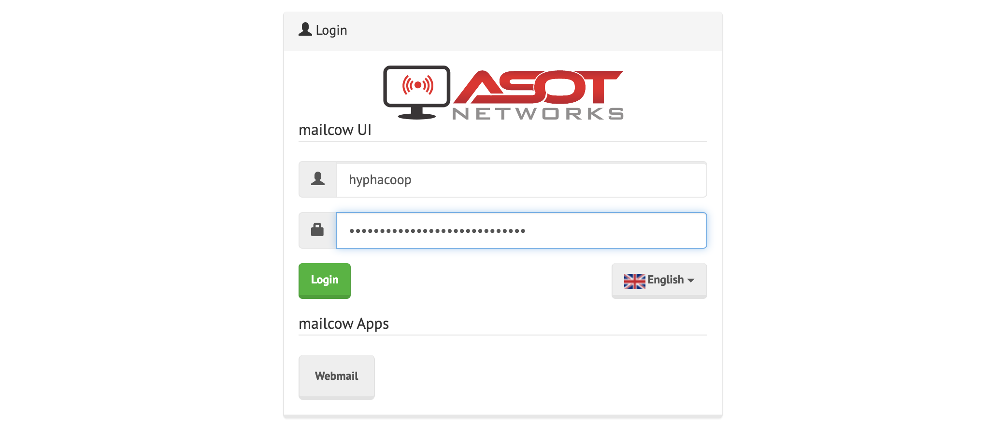
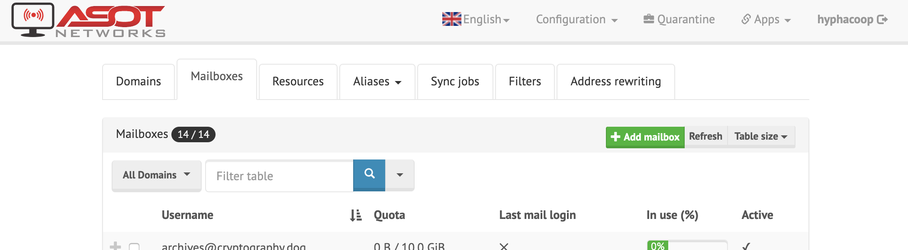

# Guides

Guides explain in practical terms how we do stuff. Any Hypha member can
change these.<sup>[1](#references)</sup>

We are inspired by the idea of "protocols" from the [Lab
Book][clear-lab-book] of the [Civic Laboratory for Environmental Action
Research (CLEAR)][clear]

> Protocols are the "attitudes" or "the manner in which one approaches each and
every element in our space." They are different than pure rules or
instructions; they are ways that we establish order and maintain practices
across our group [...] -- They define the way we ought to proceed or behave in
different situations. As such, they are normative, or premised on values,
morals, and an idea of how things ought to be done. They are a manifestation of
our values.

### Contents

- [Email](#email)
- [Invoices](#invoices)
- [Meetings](#meetings)
- [Onboarding Checklist](#onboarding-checklist)
- [Payroll](#payroll)
- [Projects](#projects)
- [Sensitive Data](#sensitive-data)
- [Shortlinks](#shortlinks)
- [Timesheets](#timesheets)
- [Voicemail](#voicemail)
- [References](#references)

## Email

### Creating new inboxes (Administrators)

What you'll need:
- Admin access to [our Mailcow email server](https://link.hypha.coop/email)
- The following user info (from https://link.hypha.coop/employees):
    - preferred email `handle@hypha.coop`
    - preferred value for "Full Name"
    - primary email (where they'd like `@hypha.coop` emails to be forwarded initially)
    - Signal-friendly phone number

_Note: Consider creating a [new GitHub issue in `hyphacoop/organizing`](https://github.com/hyphacoop/organizing/issues/new) to track email onboarding._

1. Sign into Mailcow: https://link.hypha.coop/email
    <details>
      <summary>View Screenshot</summary>
      
    </details>
2. Navigate to `Mailboxes` tab
3. Click `+Add mailbox` button at top-right of screen
    - If the namespace is already taken by an alias, ensure it's not in use before deleting it.
    <details>
      <summary>View Screenshot</summary>
      
    </details>
4. Fill out the following fields, noting the password:
    - Username: `[info provided by new user]`
    - Domain: `hypha.coop`
    - Full name: `[info provided by new user]`
    - Quota: `4096`
    - Password: `[auto-generated]`
    - Active: `checked` :ballot_box_with_check:
    <details>
      <summary>View Screenshot</summary>
      
    </details>

We'll now log in to confirm access, and set up an initial forwarder to make first-time usage simpler.

5. Open an incognito browser and access webmail login: https://mailninja.aseriesoftubez.com/SOGo/
6. Log into the account you just created.
    <details>
      <summary>View Screenshot</summary>
      
    </details>
7. Navigate through these menus:  
    `⚙` (top-left) > `Mail` menu item > `Forward` tab
8. Check "Forward incoming mail" and enter provided primary email, clicking "Keep a copy".
    <details>
      <summary>View Screenshot</summary>
      
    </details>
9. From your own `@hypha.coop` email, send a welcome email, like this template:
    >
    > Hi XXXX --
    >
    > Yay! Your Hypha email's set up and forwarding to your personal inbox. People can start emailing you at this address immediately, without any extra effort on your part.
    >
    > Your new email (and login): XXX@hypha.coop  
    > Your password: Sent via Signal to XXX-XXX-XXXX
    >
    > Having said that, when you'd like to start _sending_ email as XXX@hypha.coop, you'll need to take some more steps.
    >
    > The next steps will depend on how you like to handle email:
    > - [If you'd like to use it from your existing Gmail account...](#using-Gmail)
    > - [If you'd like to use it from our hosted webmail interface...](#using-the-web-interface)
    > - [If you'd like to use it from another email client...](l#using-your-existing-email-client)
    >
    > Once you're set up, let us know by sending a test email to infra@hypha.coop, ideally with a short emoji-only story. (Keypad mashes a-ok!) We'll send a friendly poke in a week if we haven't heard back.
    >
    > Questions? Feedback? Reach out via infra@hypha.coop or [`#hyphacoop-infra:tomesh.net`](https://chat.tomesh.net/#/room/#hyphacoop-infra:tomesh.net) for chat.
    >
    > In Solidarity,  
    > xxxxx
10. Send a low-entropy Signal message with the previously noted password, for example: `🍄 password: xxxxxxxx`

### Using your new inbox (Users)

Accessing your inbox can be done via the hosted webmail interface or by using the same email client you're already using.

What you'll need:
- Your new email address
- Your password (sent to you by admin on initial setup)

#### Using Gmail

1. Log into Gmail
2. Go to Gmail settings, by navigating through these menus:  
    `⚙` (top-left) > `Settings` menu item > `Accounts and Import` tab
3. Under "Send mail as", click "Add another email address".
    <details>
      <summary>View Screenshot</summary>
      
    </details>
5. In the new popup, enter:
    - Name: e.g., `Maria S` (as will appear to email recipients)
    - Email address: e.g., `maria@hypha.coop`
    - Treat as alias: `checked` :ballot_box_with_check:
    <details>
      <summary>View Screenshot</summary>
      
    </details>
4. Click "Next", then:
    - SMTP Server: `mailninja.aseriesoftubez.com` (auto-filled)
    - Port: `587` (auto-filled)
    - Username: e.g., `maria@hypha.coop` (ignore auto-filled)
    - Password: `[your password]`
    - TLS: `checked` :ballot_box_with_check:
    <details>
      <summary>View Screenshot</summary>
      
    </details>
5. Click "Add Account".

We'll now send your first email to Mailinator, a cloud inbox that's helpful for email testing. Then you can confirm for yourself whether it works.

5. Back in your Gmail inbox, click "Compose" to create a new email message.
6. Click the "From" address, and select your new email address from the drop-down.
    <details>
      <summary>View Screenshot</summary>
      
    </details>
8. Enter hyphacoop@mailinator.com as the "To" address, add a short subject and message, and hit send!
9. Visit [the corresponding cloud inbox](https://www.mailinator.com/v3/index.jsp?zone=public&query=hyphacoop) and confirm your message has arrived, it might take a few minutes.
    <details>
      <summary>View Screenshot</summary>
      
    </details>
11. Once it's safely arrived, you're all set! Start sending email!
12. Don't forget to email Infra WG as mentioned in onboarding email. :outbox_tray::tada:

#### Using the webmail interface

1. Visit our email server: https://link.hypha.coop/email
2. Click on `Webmail` button.
3. Enter your username and password:
    - Username is your `@hypha.coop` email
4. Once logged in you can read your emails and configure your user settings.
5. By default your emails are forwarded to your personal email to disable that follow step 1 in `Using your existing email client`.

#### Using your existing email client

<sup>These docs are condensed from [Mailcow's in-depth email client configuration docs](https://mailcow.github.io/mailcow-dockerized-docs/client/#host=MailNinja.aseriesoftubez.com&email=maria%40hypha.coop&name=Maria+Sanchez&ui=mailninja.aseriesoftubez.com&port=443&outlookEAS=1&connector=60.0.2). (Substitute your info for that of "Maria Sanchez").</sup>

1. By default emails to your `@hypha.coop` are forwarded to your personal email address if prefered that you want to turn off forwarding of your `@hypha.coop` email, log in to webmail (instructions above)
    - Navigate through these menus:  
        `⚙` (top-left) > `Mail` menu item > `Forward` tab
2. Uncheck the "Forward incoming messages", and save.
3. Open your email client.
4. Go to the "add email account" setting in your client.
5. Enter your name that you prefer that will show up in your outgoing emails and email address when prompted.
6. When prompted for username and password use your new email address e.g., `handle@hypha.coop` for username and your password for your new email.
7. Most email clients will auto-detect server settings based on your email address. If your email client does not auto-detect these settings, enter:
    - IMAP: `mailninja.aseriesoftubez.com` Port: 993 (TLS/SSL)
    - SMTP: `mailninja.aseriesoftubez.com` Port: 465 (TLS/SSL)
8. Once added, you should now be able to send from your new email. In your email client, compose an email to hyphacoop@mailinator.com with a short subject and send.
9. Visit [the corresponding cloud inbox](https://www.mailinator.com/v3/index.jsp?zone=public&query=hyphacoop) and confirm your message has arrived, It might take a few minutes.
10. Don’t forget to email Infra WG as mentioned in onboarding email.

## Invoices

Prior to creating an invoice, confirm with the client whether they would like to pay in CAD, USD, EUR, or GBP, and in what country their financial institution is based, then proceed with the following steps.

### Creating an invoice for a client

1. Go to [Quickbooks Online](https://quickbooks.intuit.com/ca/), open the `Invoicing > Customers` tab.

1. If the client is not in the customer list, click `New customer` to create a new profile for the client.

1. Click `Create invoice` on the client you wish to invoice, and use the following settings:
    - Cc.: `finance@hypha.coop`
    - Terms: `Net 15` (may vary by project)
    - Message on invoice: `[Payment instructions]` (e.g. Please pay USD 3,135.00)
    - Attachments: `[Timesheet PDFs]`

1. At the bottom of the page, click `Customize` to select a style, or create a new style template as needed.

1. If creating a new style template or the payment information needs to be changed, select the `Content` tab, click on the bottom section of the template preview to reveal the `Add payment details and footer` section, then enter the [applicable payment information](https://github.com/hyphacoop/organizing-private/blob/master/documents/finances/payments.md).

    For example:
    ```
    PAYMENT

    By ACH or domestic wire transfer to:

    ACH Transfer No. (ABA): 026073150
    Wire Transfer No. (ABA): 026073008
    Account No.: [REDACTED]
    Beneficiary Name: Hypha Worker Co-operative Inc.
    Beneficiary Address:

        TransferWise
        19 W 24th Street
        New York
        10010
        United States

    Invoice amount will be adjusted to reflect actual exchange rate after payment.
    ```

    This is an invoice for a client based in the United States, payable in USD to our TransferWise account.
    Look at a previous invoice for examples.

    Review the invoice preview, then click `Done`.

1. Fill in the line items and calculate totals.
    See example below.

    All invoices are in CAD, even if the customer is paying in a foreign currency. This means `RATE` and `AMOUNT` columns are in CAD, and if the contract is an hourly rate based on a foreign currency, you can include the information in the `DESCRIPTION` column, and use an estimated CAD equivalent in the `RATE` column and to calculate the `AMOUNT`.

1. Create a `Subtotal` line item.
    See example below.

1. Add a line item for Canadian HST, and if it is not applicable, indicate the reason in the line item `DESCRIPTION`.
    See example below.

1. Review the invoice preview, then click `Save and send` to email the invoice to the client.

| DESCRIPTION | QTY | RATE | AMOUNT |
|:------------|----:|-----:|-------:|
| Software development for Jan 2020<br />(52.25 @ USD 60.00 = 3,135.00) | 52.25    | 80.00 | 4,180.00           |
| Software development for Feb 2020<br />(20.00 @ USD 60.00 = 1,200.00) | 20.00    | 80.00 | 1,600.00           |
|                                                                       |          |       | Subtotal: 5,780.00 |
| HST @ 0%<br />Intellectual property exports, zero-rated               | 5,780.00 | 0     | 0.00               |

### Settling an invoice payment

Once the client has paid the invoice, we must check the amount received at our receiving account at [Desjardins](https://www.desjardins.com/ca/) (domestic) or [TransferWise](https://transferwise.com) (foreign currency), and record the transaction in [Quickbooks Online](https://quickbooks.intuit.com/ca/).

#### Domestic

1. After the money arrives to Desjardins, we need to update our records in Quickbooks Online:

    1. In the `Banking` tab, select our `Chequing` account and click `Update` to sync our Desjardins account.

    1. Find the transaction from the client and click on it, then select `Find match` to select the incoming transaction to match.

    1. If there is a discrepancy in the amounts, click the `Resolve` button and change `CATEGORY` to `Bank charges`, then click `Save`.

1. Archive the PDF of the paid and finalized invoice in our [shared drive](https://link.hypha.coop/drive) under the `Invoices` directory with filename `xxxx-project.pdf`, where `xxxx` is the invoice number (e.g. `1001-aether.pdf`).

#### Foreign Currency

1. Confirm the correct amount is received, then convert the foreign currency to CAD.
We can either move the money to the CAD balance in TransferWise, or if the amount is large, we can directly deposit the exchanged amount into our Desjardins account.
The following example shows how to do that in a single transaction from TransferWise:

    1. Confirm that the invoice amount of `3,757.50 USD` is received to our USD balance, then click `Send USD`.

    

    

    1. Choose `My business` and enter in our [Desjardins account information](https://github.com/hyphacoop/organizing-private/blob/master/documents/finances/payments.md) for the deposit.

    

    

    1. Note the invoice number in the `Reference` field, then click `Confirm and send`.

    

    In this example, a client in the United States sent **3,757.50 USD** to the Hypha USD account at TransferWise, and we deposited **4,904.11 CAD** at the Hypha CAD account at Desjardins.
    The transaction and exchange fee was **20.61 USD**, and the exchange rate was **1.31235**.

    If invoice amounts are small, we may batch many of them in TransferWise before depositing to Desjardins, but we should still convert foreign currencies to CAD as soon as possible and hold the amount as CAD in our TransferWise CAD balance.

    1. In the USD balance, click on `Download a statement` and download a CSV file for the date range that includes the transaction(s).
    Open the file and multiply the amounts with the exchange rate column, then save.

1. After the money arrives to Desjardins, we need to update our records in Quickbooks Online:

    1. Click `View/Edit` on the invoice and add a line item that accommodates for the discrepancy in estimated and actual exchange rates.

        In our example where we deposited **4,904.11 CAD** to Desjardins, if our invoice estimated a CAD `AMOUNT` of **4,950.00 CAD**, we would record a `Exchange rate adjustment @ 1.31235` line item with `-45.89` as `AMOUNT`.

    1. In the `Banking` tab, select our `Chequing` account and click `Update` to sync our Desjardins account.
        Find the transaction from TransferWise and click on it, then change the `Category` to `TransferWise` and click `Add`.

    1. In the `Banking` tab, select our `TransferWise` account to click `File upload` (down arrow next to `Update`) to update our TransferWise account.
        `Browse` and upload the TransferWise CSV we saved earlier, click `Next` and enter the following:
        - Date: `Column 2`
        - Description: `Column 5`
        - Amount: `Column 3`

    Click `Next` and then `Import`.

    1. Find the transaction from the client and click on it, then select `Find match` to select the incoming transaction to match.
        There should be no discrepancy in the amounts.

    1. Find the transaction from our TransferWise account to Desjardins account, then select `Find match`.
        We expect a discrepancy in the amounts.
        Click the `Resolve` button and change `CATEGORY` to `Bank charges`, then click `Save`.

    1. If there is a discrepancy, click the `Resolve` button and change `CATEGORY` to `Bank charges`, then click `Save`.

1. Archive the PDF of the paid and finalized invoice in our [shared drive](https://link.hypha.coop/drive) under the `Invoices` directory with filename `xxxx-project.pdf`, where `xxxx` is the invoice number (e.g. `1001-aether.pdf`).

## Meetings

### Scheduling a meeting

_Note: Consider whether this meeting might be a global interest to other
members. Skip the steps below at your discretion for low-stakes topics._

- Try to announce your intention to schedule a meeting on a topic and ask
  who's interested in participating. Allow _at least_ 48 hours for people to respond.
- Consider who might be most interested and what timing might work for
  them.
  - Check the [`availability` calendar for travel/vacation plans][availability].
  - Check everyone's [availability `schedules`][schedules].
- If 2-3 candidate timeslots feel obvious from looking at people's
  availabilities:
  - Reserve them all in [Hypha calendar][calendar] immediately, for example: `HOLD:
    Infrastructure Meeting (Option 1)`
  - Ask in chat whether anyone who wants to attend has any blocks on any
    of the options
- If short-notice or speed of booking is important:
  - Claim an open HOLD [:information_source:](/meetings.md#calendar-holds) slot.
    - If time permits or topic isn't an all-hands matter, consider
      leaving the hold available for someone else
    - If claiming a hold, edit the calendar immediately and announce
      meeting in chat
- If your must find a new timeslot:
  - Create a new poll (we currently use [When2Meet](https://www.when2meet.com/))
  - Leave ample time for completion (ideally 1 week)
  - Check on non-responders in following days and send (gentle)
    reminders as needed

### Hosting a meeting

- **Before** the meeting...
  - create a stub agenda as soon as possible (can be done before scheduling)
    - Hint: use [an agenda `template`][template]
  - add the agenda to the [`meetings` index][meetings]
  - update the [organizational calendar][calendar] as early as possible with candidate and finalized time slots
    progresses
  - mention the meeting time in chat, and link the agenda.
  - encourage migration of related actions, decisions and discussions
    into agenda from chat
- **During** the meeting...
  - ask for agenda items (start of meeting)
  - facilitate discussion
  - keep time
  - call attention to action items, upcoming decisions and discussions
- **After** the meeting...
  - add important dates/reminders to calendar
  - review and merge notes
  - update [meeting index][meetings] as best location changes
    (hackmd => review (PR) => file)
  - as needed, set up loomio threads and decisions
  - as needed, send reminders of action items
  - migrate action items into task tracker
  
### Joining a Jitsi Call

💻 **Desktop.** Follow [`link.hypha.coop/calls`](https://link.hypha.coop/calls) to our default conference platform.

📱 **Mobile**
  1. Install the app. [Android][jitsi-android] | [iOS][jitsi-ios]
  2. 🔗 **Visit** call URL to open app, or 📋 **copy-paste** redirected call URL (e.g. `https://jitsi.hypha.coop/hyphacoop`) into app home screen.
  
   [jitsi-android]: http://jitsi.org/android
   [jitsi-ios]: http://jitsi.org/ios

📞 **Phone**
  1. Use the private dial-in number from our [technical Jitsi documentation](https://github.com/hyphacoop/organizing-private/blob/master/documents/infrastructure/jitsi.md).
  2. _After_ prompt, enter conference code `307 314 3734 #`

## Onboarding Checklist

This is a checklist for onboarding a new Member to the Co-operative 🚀

### Setting up communications

1. Get Signal number and add to group.

1. Get Matrix account and invite to spaces:
  - Private chat `#hyphacoop-private:tomesh.net`
  - Public chat `#hyphacoop-open:tomesh.net`
  - Community `+hyphacoop:tomesh.net`

1. Set up [`hypha.coop` email](https://link.hypha.coop/email):
  - [Create new mailbox with Mailcow](#creating-new-inboxes-administrators)
  - Set up initial forwarder
  - Add to `members@`

### Setting up virtual office

1. Invite to [Passbolt](https://pass.hypha.coop):
  - After acceptance, add to `Member-Worker` group

1. Invite to [GitHub Organization](https://github.com/hyphacoop):
  - Add to `Worker-Owner` [GitHub Team](https://link.hypha.coop/teams)

1. Get Google-friendly email address:
  - Share access to [Drive](https://link.hypha.coop/drive)
  - Invite to calendars:
    - https://link.hypha.coop/calendar
    - https://link.hypha.coop/availability

1. Invite to [Loomio](https://loomio.hypha.coop/).

1. Share [weekly schedule](https://link.hypha.coop/schedules) (recommend without password).

### Setting up employee record and payroll

1. Collect information for [employee record](https://link.hypha.coop/employees).

1. Add Member SIN to Passbolt and share access with `People Operations` group.
    Change the Member access to the entry as read-only, as this information is for recording keeping and the Member should not be able to modify it.

1. Collect encrypted (see [Sensitive Data](#sensitive-data) guide) [`TD1` and `TD1-ON` forms](https://www.canada.ca/en/revenue-agency/services/forms-publications/td1-personal-tax-credits-returns.html) to [Drive](https://link.hypha.coop/drive). 

1. Add Member [as Employee in Wagepoint](#adding-a-new-employee) for payroll.

## Payroll

This guide describes how to use our payroll service provider, [Wagepoint](https://wagepoint.com), to set up a payroll run for the pay period.
You should have a completed [Employee Payroll](http://link.hypha.coop/payroll) sheet for the pay period ready, which indicates the wage information for each Employee that you will need to enter into Wagepoint.

If this is the first time you use Wagepoint, please first review the [Running your first payroll with Wagepoint - Canada](https://www.youtube.com/watch?v=KfLMcqGTDwE)video.

### Running payroll

1. Log into Wagepoint as a user with admin privileges.

1. Visit the `PAYROLL` tab.

1. **Paygroup:** Hit `NEXT` since we only have one monthly paygroup.

    

1. **Paydates:** Set the pay cycle to cover the current month (e.g., March 1-31) and the `Pay Date` to be the 15th of the current month (e.g., March 15) or the last working day prior if the 15th happens to land on a holiday (e.g., March 13).
    During that period, we settle amounts owed up to the _end of the previous month_ (e.g., Feb 29).

    
    
    Set the dates as per the above, and hit `NEXT`.
    Nothing is finalized until the last step, and you must hit `SAVE/NEXT` during each step to preserve "draft" progress.

1. **Hours:** Hit `SAVE/NEXT` to skip since we currently do not use the `Hourly` pay type.

1. **Salary:** Enter `HOURS`, `CURRENT PAY`, and `PUBLIC HOLIDAY PAY` according to the [Employee Payroll](http://link.hypha.coop/payroll) sheet for the pay period.
    Ensure that hours and pay line up, as these are the basis for ensuring legal minimum wage.

    The `VACATION HRS` for everyone is `0` due to our variable work hours and that annualized amounts will be paid out each pay period.
    
    In the `PAY?` column, select `YES` for any Employee who will be paid in this payroll.

    You can review past payrolls under the `REPORTS` tab.

1. **Process:** Verify the amounts.
    Save the PDF output of `VIEW ALL`, our "Payroll Register", into the 🔒 [`Finance > Payroll` folder in our Drive](https://drive.google.com/drive/u/0/folders/1IWyDzyeixO4Z6TbIghorqTiCbrs2N4K8).
    Click `APPROVE PAYROLL`.

1. **Confirm:** Confirm the payroll run for this pay period.
    It will be queued for processing on the `Pay Date`.

1. No further steps necessary.
    Wagepoint will withdraw funds from our bank account, and this will sync with our Quickbooks automatically.
    Our bookkeeper will see our Payroll Register in the Drive and update Quickbooks for us once per month.

### Adding a new employee

1. Log into Wagepoint as a user with admin privileges.

1. Click the `EMPLOYEES` tab and then the `ADD NEW EMPLOYEE` button at the bottom right corner.

1. Add stub details for new employee.
    Since we calculate wages per pay period outside of Wagepoint, set:
    -  Pay Type: `Yearly`
    -  Pay Rate: `0`

    

1. Return to the `EMPLOYEES` tab and click the Employee's name.
    You should now be on their profile, specifically `THE PERSON` tab, which you can fill out with info from our [employee records](https://link.hypha.coop/employees).

    

    Fill out everything you can, but leave `External ID` blank.

1. In the `THE JOB` tab, set up the Employee with the salaried method:
    - Pay Type: `Yearly`
    - Annual Salary: `$0.00`
    - Expected Hour per Week: `0.00`
    - Job Title: `No title`
    - Department: `Salary`
    - Vacation will: `be paid out each pay`

    

1. In the `TAX INFO` tab, set up the Employee's tax info based on the `TD1` and `TD1-ON` forms they submitted.
    For example:

    

1. In the `DIRECT DEPOSIT` tab, set up the bank account for direct deposit based on account information or a void cheque they submitted.

1. Return to the "Employee" tab listing, and use the "mail" icon to send an invite to the Employee to Wagepoint.

    

## Projects

### Sales Prospect & Internal Proposals

While the Business Planning WG is mainly in charge of sales lead generation,
all members may pursue leads as they come up.
Members are strongly encouraged to record leads into the co-operative's [leads tracking system](https://link.hypha.coop/leads) whether or not we want to pursue this lead.
Ask Business Planning WG for help doing this. 

If a member decides to pursue a **lead**,
they can reach out to gauge potential interest in working together.
If the lead expresses intention to proceed with a concrete project in mind,
this becomes an **opportunity**.
The member now heads up this sales effort and should draft an **internal proposal** with the Business Planning WG, then present it (e.g., at a meeting, or via virtual channels) to see whether the co-operative wants to move forward to submit a formal proposal to the prospective client.
In this meeting, we should discuss any concerns by other members,
and gauge team capacity given project timelines.
A sample internal proposal should include:

- Project Title
- Background
- Scope & Timeline
- Outcomes & Opportunities
- Skillsets
- Budget
- Communication
- Risks
- Resources

A [template](#internal-proposal-template) is included below. You can add more sections as appropriate, including sample code, project roadmap, next steps, etc. Examples and archived proposals can be found in our [shared drive](http://link.hypha.coop/drive).

### Client Proposal Drafting and Submission

Project proposals to be submitted to a potential client or grant committee should be drafted by members who expect to participate in the project with the help of members of the Business Planning WG. The WG has expertise in drafting client and grant project proposals, and managing the proposal process, so it is helpful to involve members of that group from the drafting stage. All that are involved in the proposal drafting make up the **proposal team** that will eventually sign off on the final draft to be submitted.

If a project is accepted, this team will lead the initial consultation meetings with the client (e.g. discuss terms of payment and project logistics) and gradually transfer the relationship entirely to the **project team**, which may not necessarily include everyone in the proposal team.

Regardless whether the proposal is successful,
the project team should add a copy to the archived proposals folder in our [shared drive](http://link.hypha.coop/drive) for future reference.
For failed proposals,
we highly encourage reaching out to the client or grant committee for feedback and having an internal retrospective.

### Internal Proposal Template

```
# Project Title

## Background
Background information about the client/grant and the project.

## Scope & Timeline
What are the expected deliverables and the timeline.

## Outcomes & Opportunities
How this project may be beneficial beyond the scope of the project. For example, does it lead to developing new skillsets among members or starting a relationship with a potentially long-term client?

## Skillsets
What are the important skillsets needed to ship this. If some skillsets are not available, what are the plans to source them to ensure we can deliver on this?

## Budget
Project budget and payment terms if available.

## Communication
How the logistics would look like for members working on this project. Are there weekly calls or are there physical sessions? Is the project on GitHub or is the source closed? Are there consent and confidentiality terms?

## Risks
What are the expected risks associated with this project.

## Resources
Additional resources about the project not already listed above, such as link to a website or a call for proposal.
```

## Sensitive Data

In general, most members prefer not to use third-party SaaS services, like Google Drive, for storing sensitive information.

We store **short strings** (like SINs or codes) as password entries in Passbolt. These entries should be shared with both a privileged _group_ that needs access (e.g., Finance WG) and the _individual_.

If we must **store sensitive docs** (like PDFs) in a shared drive for convenience (e.g., Google Drive),
we first encrypt them with a password.
We keep this in Passbolt under the entry `Shared Drive: Encrypted Files`.
All employees can access this password.
Simpler encryption schemes are preferred, for example, default PDF encryption.
We recommend any secured `file.pdf` be renamed to `file.encrypted.pdf` for easy discovery.

As a last resort for sensitive docs, a member can choose to have the document **printed and stored** in a folder in the office.

## Shortlinks

### Managing shortlinks

We use a custom shortlink service at `link.hypha.coop`. It helps us:
- resolve keywords to URLs from any computer,
- make commonly used resources quickly and easily accessible,
- simplify link-sharing in spoken conversations, and
- align on shorthand keywords for resources.

Instructions on creating and managing shortlinks are available in
our [`shortlinks` repo](https://github.com/hyphacoop/shortlinks).

### Accessing shortlinks

> **Hint:** You can use a URL hash to deep-link into an expanded shortlink.
> Example:&nbsp;http://link.hypha.coop/inventory#MailCow

Shortlinks work on their own in the address bar, but for even easier access on your own
workstation, you can **add a "custom search engine" keyword to your
browser**.

This allows you to type something like `h<tab>shortlinks` into the
search bar, and get https://link.hypha.coop/shortlinks

Here's a screencast of how it works on Chrome:


Instructions:
[Chrome](https://www.techrepublic.com/article/pro-tip-add-custom-search-engines-in-chrome-for-more-efficient-searching/)
| [Firefox (requires extension)](https://addons.mozilla.org/en-US/firefox/addon/add-custom-search-engine/)

## Timesheets

Members log their work hours using [Clockify](https://clockify.me), and project timesheets may be generated to determine the invoice amount each period for some clients, and often for calculating member wages.
This process is done using the Clockify [Summary Report](https://clockify.me/reports/summary).
Saved reports are found under [Saved Reports](https://clockify.me/reports/saved).

Follow these steps to generate and archive your project timesheets:

1. When a project begins, generate a **team project report** in Clockify and save with the name `project_YYYYMM` where `YYYYMM` indicates the first month the project is active (e.g. [aether_201908](https://clockify.me/bookmarks/5db255d9e8cd9c50073f35ad))
1. When a member joins a project, generate a **personal project report** in Clockify and save with the name `project_YYYYMM_xx` where `YYYYMM` indicates the first month the member is active on the project and `xx` is the initials of the member (e.g. [aether_201908_bl](https://clockify.me/bookmarks/5dab94738a17084c0337690d) and [aether_201908_yj](https://clockify.me/bookmarks/5dab94828a17084c03376911))
1. To generate timesheets, open the team or personal project report and export as PDF for the applicable report period (to be sent to client, if applicable)
1. Timesheet PDFs sent to clients or for internal payroll calculation should be archived in our [shared drive](https://link.hypha.coop/drive) under the `Timesheets` directory. In this example:

    ```
    Timesheets
    ↳ aether_201908
      ↳ personal
        ↳ bl
          # Personal timesheets for bl, used to calculate wages
          - clockify-report-2019-08-01-to-2019-08-31.pdf
          - clockify-report-2019-09-01-to-2019-09-30.pdf
          - ...
        ↳ yj
          # Personal timesheets for yj, used to calculate wages
          - clockify-report-2019-08-01-to-2019-08-31.pdf
          - clockify-report-2019-09-01-to-2019-09-30.pdf
          - ...
      ↳ team
          # Team timesheets, used to invoice client
          - clockify-report-2019-08-01-to-2019-08-31.pdf
          - clockify-report-2019-09-01-to-2019-09-30.pdf
          - ...
    ```

## Voicemail

### Accessing Voicemail 

We use a VoIP phone line provider with forwarding and voicemail from [FreePhoneLine.ca](https://www.freephoneline.ca/login). It helps us:

- Have a phone number without tying it to a physical location
- Receive voicemail by email to [members@hypha.coop](mailto:members@hypha.coop)

To access voicemail inbox you can either call remotely or through a configured SIP client.

- Remotely:
  1. Call the dial-in number `14164770355`
  1. Enter our account number `14378876936`
  1. Enter our password: <in our shared password manager [Passbolt](https://pass.hypha.coop/auth/login)>
- SIP client: 
  Dial `*98`

### Managing Voicemail and Phone Forwarding

To record or update the voicemail greeting [access the voicemail](#accessing-voicemail) per above and select the following options:

- 3 - Personal options
- 3 - Greetings 
- 2 - Personal greeting 
- 2 - Record a personal greeting

## References

<sup>1. Inspired by [Enspiral Handbook: Guides](https://handbook.enspiral.com/guides.html)</sup>

<!-- Links -->
   [clear-lab-book]: https://civiclaboratory.nl/clear-lab-book/
   [clear]: http://civiclaboratory.nl
   [availability]: https://link.hypha.coop/availability
   [schedules]: https://link.hypha.coop/schedules
   [meetings]: https://link.hypha.coop/meetings
   [template]: https://link.hypha.coop/template
   [calendar]: https://link.hypha.coop/calendar
   [service-inventory]: https://hackmd.io/WXS9Ie9wQ8OlmIhSpDpdmw?view
