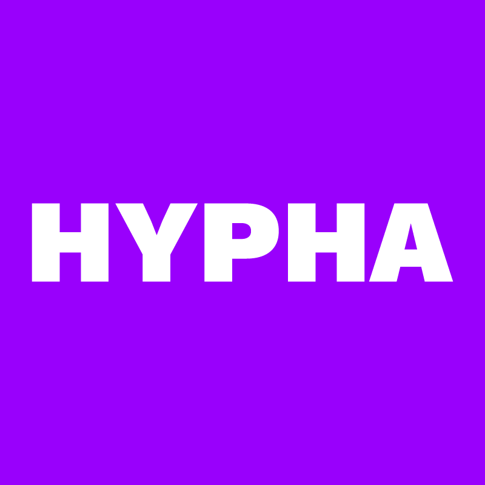
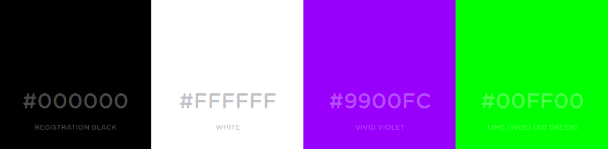

# Look and Feel

### Name and wordmark

In prose or body text our name is in title case:

- Hypha Worker Co-operative [when referenced for the first time in body text]
- Hypha [short form and after initial reference]
- Hypha Worker Co-operative Inc. [our legal name]  

For web or print treatments we uppercase "Hypha": 

- **HYPHA** Worker Co-operative  
- **HYPHA**  

We use the following wordmark in online spaces, services, and social media where we represent the organization: 

### Typography

Our **heading typeface** is [Work Sans](https://github.com/weiweihuanghuang/Work-Sans) and our **secondary (body) typeface** is [Proxima Nova](https://www.marksimonson.com/fonts/view/proxima-nova). For the web we prefer using the sans-serif [system font stack](https://css-tricks.com/snippets/css/system-font-stack/) as our typeface.

#### Body typeface (web)

> `font-family: -apple-system, BlinkMacSystemFont, avenir next, avenir, helvetica neue, helvetica, ubuntu, roboto, noto, segoe ui, arial, sans-serif`

### Colours

**Black (X11 Black)**  
> `#000000;`  
> `rgb(0, 0, 0);`  

**Grey**   
> `#777777;`   
> `rgb(119, 119, 119);`

**White**  
> `#FFFFFF;`  
> `rgb(255, 255, 255);`  
  
**Vivid Violet**  
> `#9900FC;`  
> `rgb(153, 0, 252);`  

**Lime (Web) (X11 Green)**  
> `#00ff00;`  
> `rgb(0, 255, 0);`  

### Preferred icons and emoji

We tend to use the following emoji and iconography: 

🍄 `:mushroom:`  
🌿 `:herb:`  
🏴 `:black_flag:` or  ⚑ `&#9873;`  
🐛 `:bug:`  
🌱 `:seedling:`  
🎛️ `:control_knobs:`  
🌴 `:palm_tree:`  
🍹 `:tropical_drink:`  
☀️ `:sunny:`  
🛰️ `:artificial_satellite:`  

### Assets and templates

Look and feel assets are available in our [Public Drive](https://drive.google.com/drive/folders/1dFhhx1g9MlNx5w2cd5eCSvBn6KAj6VSW?usp=sharing), and include:

- Wordmark
- Image bank

